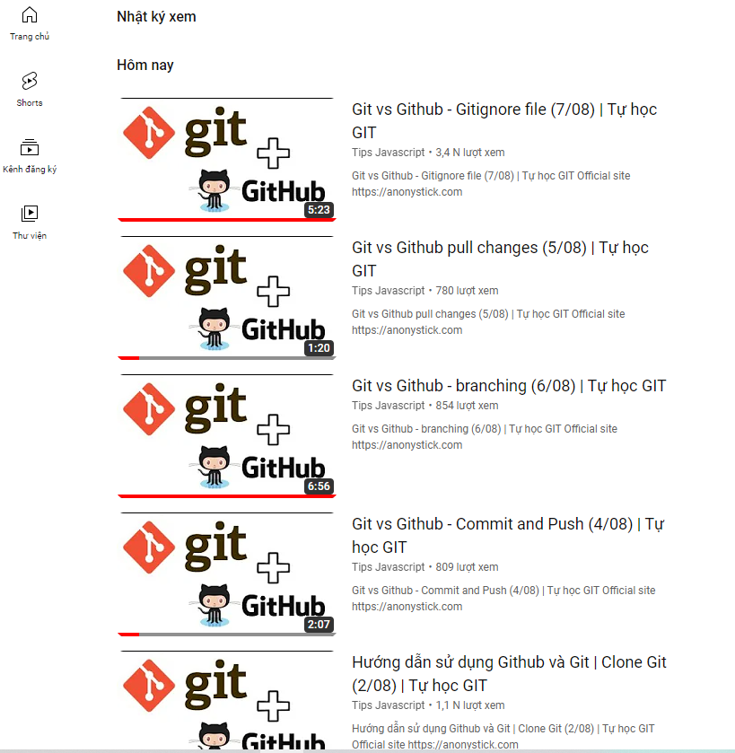
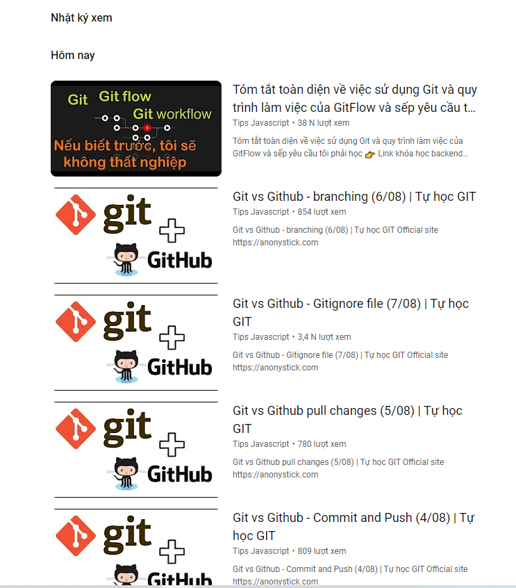

# 1. Git - Github
- Git is a free and open source distributed version control system designed to handle everything from small to very large projects with speed and efficiency.
- GitHub là một dịch vụ cung cấp kho lưu trữ mã nguồn Git dựa trên nền web cho các dự án phát triển phần mềm. 

# 2. Table of contents
- [1. Git - Github](#1-git---github)
- [2. Table of contents](#2-table-of-contents)
- [3. Download and install](#3-download-and-install)
- [4. Clone git](#4-clone-git)
- [5. Setting](#5-setting)
- [6. Commit and Push](#6-commit-and-push)
- [7. Pull changes](#7-pull-changes)
- [8. Branches](#8-branches)
- [9. Gitignore file](#9-gitignore-file)
- [Rebase and Merge](#rebase-and-merge)
- [10. Other command](#10-other-command)
- [Git flow](#git-flow)
    - [Sua loi](#sua-loi)
- [Github](#github)
- [11. Source](#11-source)
- [12. Demonstration](#12-demonstration)


# 3. Download and install
- Git: https://git-scm.com/
- Github: https://github.com/

# 4. Clone git
> git clone https://github.com/xxxx.git

# 5. Setting
> git config --global user.name "your_username"
> git config --global user.mail "your_username"

Use --local to config the local name, mail, ....

# 6. Commit and Push
- Commit: luu lai cac file cua du an vao trong git
- Push: Day du an len tren github

```git
- Save to Git
touch index.js
git add index.js
git status
git commit -m "your message"
- Push to github
git push origin main
```

# 7. Pull changes
```git
- Sua doi file tren responsity cua github
- Keo du lieu ve git
git pull

```
# 8. Branches
Trong du an moi nguoi se duoc phan mot nhiem vu. Do do moi nguoi tao mot nhanh. Sau do leader se kiem tra va them vao nhanh chinh.

```git
- Tao nhanh
git checkout -b new_branch
- Xem tat ca nhanh
git branch
- So sanh nhanh hien tai voi nhanh main
git diff main
- Push ban cap nhat len github
git push -u origin branch_name
- Doi nhanh lam viec
git checkout branch_name(main)
- Cap nhat code len nhanh chinh (dung o nhanh main)
git merge branch_name
- Luu code va push len github
git add file.txt
git commit -m "Message"
git push -u origin main
```

# 9. Gitignore file
Trong du an se co cac file config, file chua thong tin ca nhan khong push len git duoc, hoac la cac package.... Do do chung ta can dung .gitignore de cau hinh cho nhung file nay khong cap nhat va luu lai trong git.

```git
- Tao file ignore
touch .gitignore
- Them danh sach vao ignore file
- Day file ignore len
git add .gitignore
git commit -m "add ignore file"
git push
```

# Rebase and Merge

> Source: https://youtu.be/l0VtRcPz1ME?list=PLw0w5s5b9NK7dTWqY1li4u4_dZMNeSjQv

# 10. Other command

```git
- Xem lich su
git log --pretty=online

```

# Git flow

- Tao nhanh chinh master: khong sua doi code tren nhanh nay
- Tao nhanh developer song song voi nhanh master de hop nhat cac nhanh khac. 
- Phat trien tinh nag
  - Tao cac nhanh tinh nang (future branches).
  - Cac nhanh tinh nang hoan thanh thi merge lai nhanh developer
  - Nhanh developer day len nhanh release
  - Nhanh release se day len master
  - Nhanh master day len production
  - Xoa release version
  - Lap lai de phat trien cac tinh nang khac
- Sua loi
  - Day loi ve nhanh hotfixes
  - Dua ve nhanh developer
  - Sau do se tuong tu nhu phat trien tinh nang
  - Neu loi nho va xu ly nhanh thi tu hotfixes day lai master va day len production luon

```git
- Tao repo cho du an
create repo in github
create file, folder, project (README.md)
git init
git add README.md
git commit -m "first commit"
git branch -M main
git remote add origin https://xxx.git
git push -u origin main
- Tao nhanh develop
git branch develop
git branch
git push -u origin develop
- Leader giao nhiem vu cho developer (issues in github #1)
- Tao nhanh tinh nang va sua code
git checkout -b feature/1-add-cart.model-file devolop
code cac chuc nang theo yeu cau
git add 
git status
git commit -m "#1 - anhdev update cart model"
git push
Note: #1 la so thu tu cua nhiem vu, commit message phai co #1 - de reference commit vao task tuong ung trong issua github
- Pull len nhanh develop - github (nho reference #1)
- Leader xem xet, neu code ok thi se merge len develop
- Xoa future 1 branch
git branch -d feature/1-add-cart.model-file (xoa local)
git push origin -d feature/1-add-cart.model-file (xoa github)
- Day tu nhanh develop len release
git checkout develop
git pull
git checkout -b release-1.0.0
git add / status
git commit -m 'publish release v1.0.0'
git tag 'v1.0.0'
git push
git merge develop
git push -u origin release-1.0.0
- Leader merge nhanh release-1.0.0 len main, sau do day len production
git checkout main
git pull
git tag 'v1.0.0'
git push --tags 
- tao tag va day tag len github
git tag 'v1.0.0'
git push --tags
- Xoa release branch
git branch
git branch -d release-1.0.0 (xoa local)
git push origin -d release-1.0.0 (xoa github)

```
### Sua loi
```git
git checkout -b hotfixes
-thuc hien sua loi
git add 
git commit -m "#4 = fix product"
git push
Xem pull request, compare, merge to main (github)
git checkout main
git pull
git branch -d hotfixes
```

> Source: https://nvie.com/posts/a-successful-git-branching-model/

# Github
- Issues: giao nhiem vu, dat cau hoi

# 11. Source
- https://youtu.be/5b9_Y9hZJOU?list=PLw0w5s5b9NK7dTWqY1li4u4_dZMNeSjQv
- https://www.youtube.com/watch?v=vQgcl8VouLU&list=PLw0w5s5b9NK7dTWqY1li4u4_dZMNeSjQv&index=9

# 12. Demonstration

