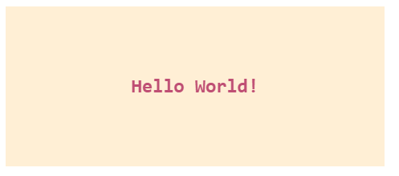
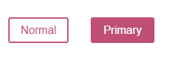
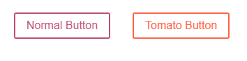
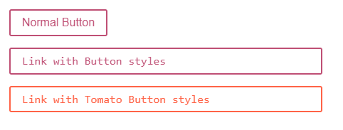
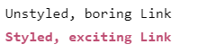

# Styled-Components
- Styled-Components là một thư viện giúp bạn có thể tổ chức và quản lý code CSS một cách dễ dàng trong các project React. Nó được xây dựng với mục tiêu giữ cho các styles của các components trong React gắn liền với chính các components đó. Nó cung cấp một interface rõ ràng và dễ sử dụng cho cả React và React Native. Nó không chỉ thay đổi việc implement các components trong React mà còn thay đổi cả lối tư duy trong việc xây dựng styles cho các component đó.  
- styled-components: enhance CSS for styling React component systems.
- styled-components utilises tagged template literals to style your components.

It removes the mapping between components and styles. This means that when you're defining your styles, you're actually creating a normal React component, that has your styles attached to it.

# Coming from CSS
## How do Styled Components work within a component?
If you're familiar with importing CSS into your components (e.g. like CSSModules) you'll be used to doing something like this:
```js
import React from 'react';
import styles from './styles.css';


export default class Counter extends React.Component {
  state = { count: 0 };


  increment = () => this.setState({ count: this.state.count + 1 });
  decrement = () => this.setState({ count: this.state.count - 1 });


  render() {
    return (
      <div className={styles.counter}>
        <p className={styles.paragraph}>{this.state.count}</p>
        <button className={styles.button} onClick={this.increment}>
          +
        </button>
        <button className={styles.button} onClick={this.decrement}>
          -
        </button>
      </div>
    );
  }
}
```

Because a Styled Component is the combination of the element and the rules that style it, we'd write Counter like this:

```js
import React from 'react';
import styled from 'styled-components';


const StyledCounter = styled.div`
  /* ... */
`;
const Paragraph = styled.p`
  /* ... */
`;
const Button = styled.button`
  /* ... */
`;


export default class Counter extends React.Component {
  state = { count: 0 };


  increment = () => this.setState({ count: this.state.count + 1 });
  decrement = () => this.setState({ count: this.state.count - 1 });


  render() {
    return (
      <StyledCounter>
        <Paragraph>{this.state.count}</Paragraph>
        <Button onClick={this.increment}>+</Button>
        <Button onClick={this.decrement}>-</Button>
      </StyledCounter>
    );
  }
}
```

# Plus
- Automatic critical CSS
- No class name bugs
- Easier deletion of CSS
- Simple dynamic styling
- Painless maintenance
- Automatic vendor prefixing

# Installation
```cmd
# with npm
npm install styled-components

# with yarn
yarn add styled-components

# import 
import styled from 'styled-components';
```
# Getting Started
This example creates two simple components, a wrapper and a title, with some styles attached to it:
```js
/ Create a Title component that'll render an <h1> tag with some styles
const Title = styled.h1`
  font-size: 1.5em;
  text-align: center;
  color: #BF4F74;
`;

// Create a Wrapper component that'll render a <section> tag with some styles
const Wrapper = styled.section`
  padding: 4em;
  background: papayawhip;
`;

// Use Title and Wrapper like any other React component – except they're styled!
render(
  <Wrapper>
    <Title>
      Hello World!
    </Title>
  </Wrapper>
);
```



# Adapting based on props
You can pass a function ("interpolations") to a styled component's template literal to adapt it based on its props.

This button component has a primary state that changes its color. When setting the $primary prop to true, we are swapping out its background and text color.

```js
const Button = styled.button<{ $primary?: boolean; }>`
  /* Adapt the colors based on primary prop */
  background: ${props => props.$primary ? "#BF4F74" : "white"};
  color: ${props => props.$primary ? "white" : "#BF4F74"};

  font-size: 1em;
  margin: 1em;
  padding: 0.25em 1em;
  border: 2px solid #BF4F74;
  border-radius: 3px;
`;

render(
  <div>
    <Button>Normal</Button>
    <Button $primary>Primary</Button>
  </div>
);
```



# Extending Styles
Quite frequently you might want to use a component, but change it slightly for a single case. Now, you could pass in an interpolated function and change them based on some props, but that's quite a lot of effort for overriding the styles once.
```js
// The Button from the last section without the interpolations
const Button = styled.button`
  color: #BF4F74;
  font-size: 1em;
  margin: 1em;
  padding: 0.25em 1em;
  border: 2px solid #BF4F74;
  border-radius: 3px;
`;

// A new component based on Button, but with some override styles
const TomatoButton = styled(Button)`
  color: tomato;
  border-color: tomato;
`;

render(
  <div>
    <Button>Normal Button</Button>
    <TomatoButton>Tomato Button</TomatoButton>
  </div>
);
```


In some cases you might want to change which tag or component a styled component renders.

```js
const Button = styled.button`
  display: inline-block;
  color: #BF4F74;
  font-size: 1em;
  margin: 1em;
  padding: 0.25em 1em;
  border: 2px solid #BF4F74;
  border-radius: 3px;
  display: block;
`;

const TomatoButton = styled(Button)`
  color: tomato;
  border-color: tomato;
`;

render(
  <div>
    <Button>Normal Button</Button>
    <Button as="a" href="#">Link with Button styles</Button>
    <TomatoButton as="a" href="#">Link with Tomato Button styles</TomatoButton>
  </div>
);
```


This works perfectly fine with custom components too!

# Styling any component
The styled method works perfectly on all of your own or any third-party component, as long as they attach the passed className prop to a DOM element.

```js
/ This could be react-router-dom's Link for example
const Link = ({ className, children }) => (
  <a className={className}>
    {children}
  </a>
);

const StyledLink = styled(Link)`
  color: #BF4F74;
  font-weight: bold;
`;

render(
  <div>
    <Link>Unstyled, boring Link</Link>
    <br />
    <StyledLink>Styled, exciting Link</StyledLink>
  </div>
);
```


> You can also pass tag names into the styled() factory call, like so: styled("div"). In fact, the styled.tagname helpers are just aliases that do the same.

# Passed props
If the styled target is a simple element (e.g. styled.div), styled-components passes through any known HTML attribute to the DOM. If it is a custom React component (e.g. styled(MyComponent)), styled-components passes through all props.

# Define Styled Components outside of the render method
It is important to define your styled components outside of the render method, otherwise it will be recreated on every single render pass. Defining a styled component within the render method will thwart caching and drastically slow down rendering speed, and should be avoided.

# Pseudoelements, pseudoselectors, and nesting
The preprocessor we use, stylis, supports scss-like syntax for automatically nesting styles.
Through this preprocessing, styled-components supports some advanced selector patterns:
- `&` refers to `all instances` of the component;
- `&&` refers to `an instance` of the component; this is useful if you're doing conditional styling overrides and don't want a style to apply to all instances of a particular component
- `&&` a double ampersand alone has a special behavior called a "precedence boost"; this can be useful if you are dealing with a mixed styled-components and vanilla CSS environment where there might be conflicting styles:
> If you put selectors in without the ampersand, they will refer to children of the component.

# Attaching additional props
To avoid unnecessary wrappers that just pass on some props to the rendered component or element, you can use the .attrs constructor. It allows you to attach additional props (or "attributes") to a component.

# Overriding .attrs
Notice that when wrapping styled components, .attrs are applied from the innermost styled component to the outermost styled component.
This allows each wrapper to override nested uses of .attrs, similarly to how CSS properties defined later in a stylesheet override previous declarations.

# Animations
CSS animations with @keyframes aren't scoped to a single component but you still don't want them to be global to avoid name collisions. This is why we export a keyframes helper which will generate a unique instance that you can use throughout your app:

```js
/ Create the keyframes
const rotate = keyframes`
  from {
    transform: rotate(0deg);
  }

  to {
    transform: rotate(360deg);
  }
`;

// Here we create a component that will rotate everything we pass in over two seconds
const Rotate = styled.div`
  display: inline-block;
  animation: ${rotate} 2s linear infinite;
  padding: 2rem 1rem;
  font-size: 1.2rem;
`;

render(
  <Rotate>&lt; 💅🏾 &gt;</Rotate>
);
```


# Notes
---
The CSS rules are automatically vendor prefixed, styled-components takes care of that for you!

Styled components uses stylis.js package under the hood for prefixing the css rules.

For additional information about the supported prefixes in stylis.js visit their repository.   

---


# Reference
> source: 
> https://viblo.asia/p/styled-component-trong-react-eW65G29RlDO
> https://styled-components.com/docs/basics
> https://www.freecodecamp.org/news/styled-components-in-react/